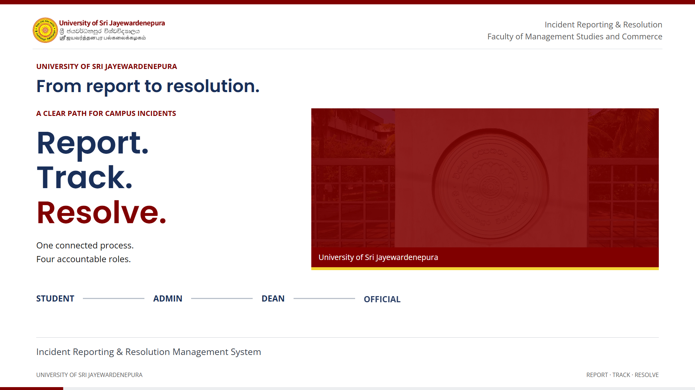

# Incident Reporting & Resolution Management System

A full-stack web application for the **University of Sri Jayewardenepura** (Faculty of Management Studies and Commerce) to report campus incidents, verify reports, assign responsible officials, track progress, and close cases through a defined institutional workflow.

Students, administrators, the Dean, and university officials each use role-specific workspaces. Public users can browse verified incidents without an account.

## Product walkthrough

[](./usj-incident-walkthrough.mp4)

**[▶ Watch the walkthrough](./usj-incident-walkthrough.mp4)** — 55 seconds · 1080p · English neural narration with consistent pacing.

Click the preview to open the video on GitHub. [Download the MP4](./usj-incident-walkthrough.mp4?raw=true).

<!-- The editable source under videos/ is gitignored. Copy the latest natural-voice render to usj-incident-walkthrough.mp4 and refresh the preview image when updating this demo. -->

## Features

- **Incident lifecycle** — Submitted → review → verification → Dean assignment → official progress → resolution → closure
- **Role-based access** — Student, Admin, Dean, and Official permissions enforced on the API
- **Student sign-in** — Accounts provisioned from a university roster (MC number + initial CPM password); optional password change after first login
- **Public incident register** — Search, filter, and view approved public reports; student upvoting on public listings
- **Evidence** — Image uploads via Cloudinary
- **Incident revisions** — Student edits to approved incidents require administrator review; operational notes replace chat
- **Notifications** — In-app notification support for operational events

## Architecture

```text
Browser (Next.js on Vercel)
        │  Same-origin /api proxy, HTTPS, HttpOnly session cookies
        ▼
Django REST API (Railway)
        │
        ├── PostgreSQL (Railway)
        └── Cloudinary (media)
```

| Layer      | Technology                          |
|-----------|--------------------------------------|
| Frontend  | Next.js, React, TypeScript, Tailwind |
| Backend   | Django, Django REST Framework, database sessions |
| Database  | PostgreSQL (SQLite optional locally) |
| Media     | Cloudinary                           |
| Deploy    | Vercel (frontend), Railway (API + DB)|

## Repository layout

```text
Incident_Management/
├── backend/          # Django API, models, tests, management commands
├── frontend/         # Next.js application
├── usj-incident-walkthrough.mp4   # README demo video (committed)
├── AGENTS.md         # Engineering rules and security requirements
├── DESIGN.md         # UI and visual specification
└── LICENSE           # MIT License
```

## Prerequisites

- **Python** 3.12+ (3.14 supported in local development)
- **Node.js** 20+ and npm
- **PostgreSQL** (production) or omit `DATABASE_URL` for local SQLite
- **Cloudinary** account (for incident images in non-trivial deployments)

## Local development

### Backend

```bash
cd backend
python -m venv venv
# Windows: venv\Scripts\activate
# macOS/Linux: source venv/bin/activate
pip install -r requirements.txt
cp .env.example .env   # edit values as needed
python manage.py migrate
python manage.py runserver
```

API base URL: `http://localhost:8000/api`

**SQLite:** If `DATABASE_URL` is not set in `.env`, Django uses `backend/db.sqlite3`.

### Frontend

```bash
cd frontend
npm install
cp .env.example .env.local
npm run dev
```

App URL: `http://localhost:3000`  
Set `API_PROXY_URL=http://127.0.0.1:8000/api` in `.env.local`. The browser always uses `/api`; the proxy keeps cookies on the frontend origin.

## Account provisioning

Students **cannot** self-register.

### Students (roster import)

1. Prepare a roster **CSV** or **Excel** file with `mc_number` and `cpm_number` columns (or `Mc Number` / `Cpm Number`, as in `TEST.xlsx` sheet `IT`).
2. Run:

```bash
cd backend
python manage.py import_student_roster
# Optional: python manage.py import_student_roster --file path/to/roster.csv
# Optional: python manage.py import_student_roster --file path/to/TEST.xlsx
```

Existing student passwords are **not** overwritten on re-import; only new MC numbers are created.

### Admin and Dean (controlled setup)

```bash
python manage.py create_staff_user \
  --email dean@example.com \
  --name "Dean User" \
  --password "secure-password" \
  --role DEAN
```

Use `--role ADMIN` for an administrator. Officials are created by the Dean through the application, not this command.

## Environment variables

| Location | File | Purpose |
|----------|------|---------|
| Backend  | `backend/.env` | See `backend/.env.example` — secret key, database, CORS/CSRF, Cloudinary, email |
| Frontend | `frontend/.env.local` | `API_PROXY_URL` (server-side proxy target) |

Never commit `.env` files or secrets to version control.

## Deployment (overview)

1. **Railway** — Deploy `backend/`, attach PostgreSQL, set environment variables, run migrations, then `import_student_roster` (and `create_staff_user` for initial Dean/Admin if needed).
2. **Vercel** — Deploy `frontend/`, set `API_PROXY_URL` to the Railway HTTPS API URL (include `/api`) before building.
3. Configure `DJANGO_DEBUG=False`, allowed hosts, `CORS_ALLOWED_ORIGINS`, and `CSRF_TRUSTED_ORIGINS` with the exact Vercel production origin.

See [PRODUCTION_READINESS.md](./PRODUCTION_READINESS.md) for session rollout, media protection, retired chat migration, and validation results. Apply database migrations before serving the updated application. All existing JWT logins must sign in again.

See `backend/railway.toml` and `frontend/vercel.json` for project-specific deployment hints.

## Tests

```bash
cd backend
python manage.py test
```

Permission and workflow tests cover authentication, incidents, voting, and role boundaries.

## Documentation for contributors

- **[AGENTS.md](./AGENTS.md)** — Architecture, roles, API rules, security, and definition of done
- **[DESIGN.md](./DESIGN.md)** — Institutional UI specification (colors, layout, responsive behavior)

Read both before making substantial changes.

## License

This project is licensed under the [MIT License](./LICENSE).

## Authors

Developed by [Oshadha Canchana](https://github.com/MHOC96) and [P.M.A Thevindu Nethmina Ariyathilaka](https://github.com/Thevindu23).

Built for the University of Sri Jayewardenepura — Incident Reporting & Resolution Management System.
